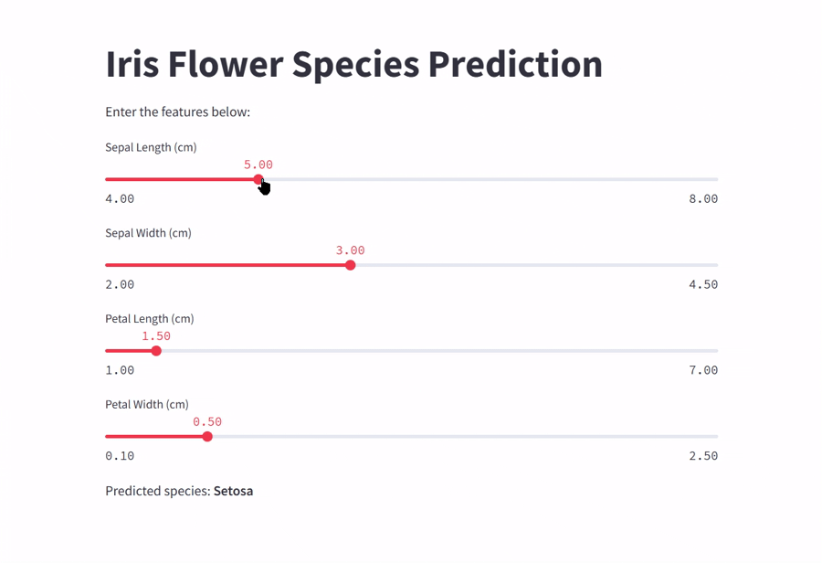

# Iris Flower Species Prediction App

This is a Streamlit web application that predicts the species of the Iris flower based on user-provided measurements of sepal length, sepal width, petal length, and petal width.

The app uses a pre-trained Random Forest model to classify the Iris flower into one of three species:

- Setosa
- Versicolor
- Virginica

Simply adjust the sliders for each feature, and the app will display the predicted species instantly.

The model was trained using the classic Iris dataset from scikit-learn.

## Demo

 

## Dependencies

This app requires the following Python packages:

- streamlit
- scikit-learn
- pandas
- numpy
- joblib

These dependencies are listed in the `requirements.txt` file.

